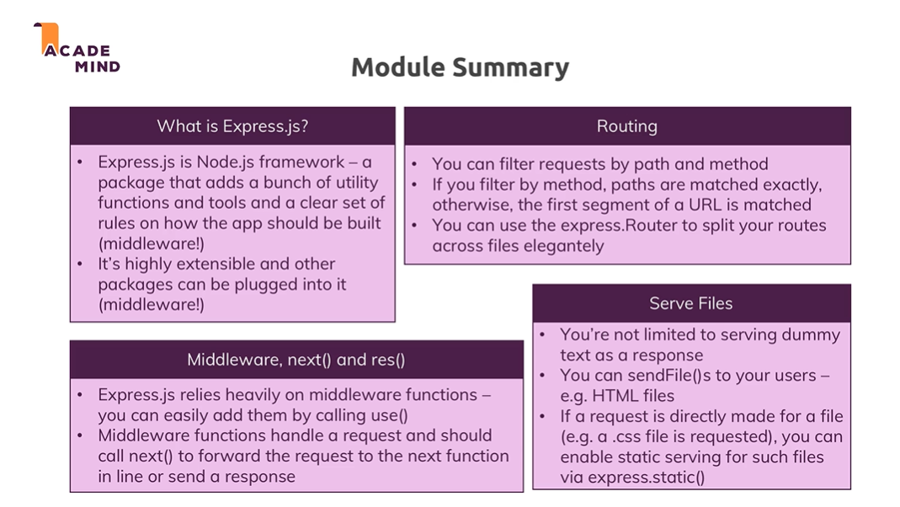

#### reference Notes from Node.js - The Complete Guide by Maximilian Schwarzmuller
- summary 
- one important concept that pretty much defines Express.js, or that Express.js is built around, Middleware
- Middleware means that an incoming request is automatically funneled through a bunch of functions by Express.js
- So instead of just having one requestHandler, you will actually have a possibility of hooking in multiple functions, which the request will go through until you send the response. This allows you to split your code into multiple blocks or pieces, instead of having one huge function that does everything and this is the pluggable nature of express.js, where you can easily add other third-party packages, which simply happen to give you such Middleware functions that you can plug into express.js
- `use` allows us to add a new Middleware function.
- `use` can receive a function with three arguments request, response and function next. `next` is a function that will be passed to this function by Express.js. this function has to be executed to allow the request to travel on to the next Middleware
-  So it basically goes from top to bottom, through that file you could say, through all the Middleware functions, but only if we call 'next', if we don't call 'next' it just dies.
- So this is a crucial concept, this idea of Middlewares and you can use any function that has this format, so that that receives request, response and next and you should call next if you want to allow the request to go to the next function. You should send a response if you got other plans
-  but by default, request doesn't try to parse the incoming request body, to do that we need to register a Parser and we do that by adding another middleware and you typically do that before your route handling middlewares, because the parsing of the body should be done no matter where your request ends up
- `bodyparser.urlencoded`registers a middleware, so this function in the end just yields us such a middleware function, this package will in the end in this middleware function call 'next', so that the request also reaches our middleware, but before it does that, it will do that hold request body parsing and gives we get, a JavaScript object with a key value pair
- app.use is for any kind of request , app.get for get , app.post for post etc. **get and post methods does exact match** whereas use does any match
- to redirect a path use response.redirect
- to send error page for unknown path create catch all app.use which can send error page as response

#### express router
- create a router file e.g. adminRoutes and import express in it
- create  Router  by calling `express.Router( )`
- This Router is like a mini Express app tied to the other express app, or pluggable into the other Express
- in routes file  use 'module.exports' and set it equal to the 'Router'
- in main app file we can take adminRoutes and just call `app.use` and put our (adminRoutes) in there, just like this, not calling it like a function 
-  If we have such a setup where our paths in such a router file start with the same part or with the same segment here, we can take that segment out of this route her (from the admin file) and then go to the app.js file and add it here (in the use method), so add that segment as a filter. Now only routes starting with '/admin' will go into the adminRoutes file, so to say and not only that, it also will or express.js will also omit or ignore this /admin part in the URL now, when it tries to match these routes. 

#### creating and serving html
- add html files in views folder
- send this html using `response.sendFile`
- to get the path for html file
- in order to construct a path to this directory and this file here, ultimately, we can use a feature provided by Node.js another core module, we can import the 'path' core module by requiring 'path'
- we send a file where we create a path with the help of this module, by calling the 'join' method
- Now the first segment we should pass here is then actually a global variable made available by Node.js and that is the underscore underscore and that's important, these are two underscores '_ _dirname'. This is a global variable which simply holds the absolute path on our operating system to this project folder and now we can add a comma and simply add 'views' here, because the first segment is basically the path to this whole project folder
- we're using 'path.join', because this will automatically build the path in a way that works on both Linux systems and Windows systems,
-'dirname' gives us the path to the file in which we use it but views is located in sibling folder so we can join `../`
- to navigate to root folder use `path.dirname(require.main.filename);` or `process.cwd()`

#### serving static files
- you can create a new subfolder and you can name it whatever you want, but the convention is to call it 'public', because you want to indicate that this is a folder that holds content, which are always exposed to the public crowd or which is always exposed to the public, so where you don't need any permissions to access it.
- we need to be able to serve files statically and statically simply means not handled by the express router or other middleware, but instead directly forwarded to the file system. 
- `app.use(express.static(path.join(__dirname, 'public')));` provides access to public path
- html having path for css should not have public in it directly act as if we are in the public folder already, because this is basically what Express will do here.
- so anything that tries to find a '.css' or dot JavaScript files, if we have to request it automatically forwards it to the public folder and therefore then the remaining path has to be everything, but that public, so therefore we strip the public out of this path and just act as if we already are in the public folder, because this is where file requests will be forwarded to.
- you could register multiple static folders and it will funnel the request through all of them, until it has a first hit for the file it's looking for, but here I'll just go with the 'public' folder. 