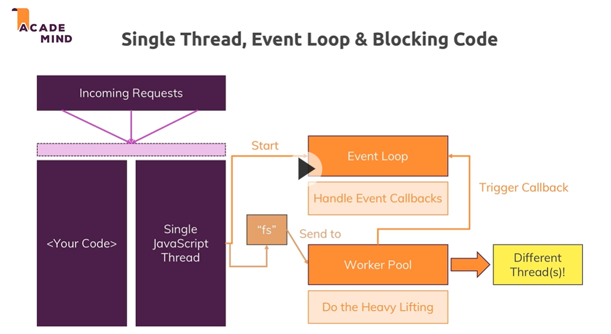
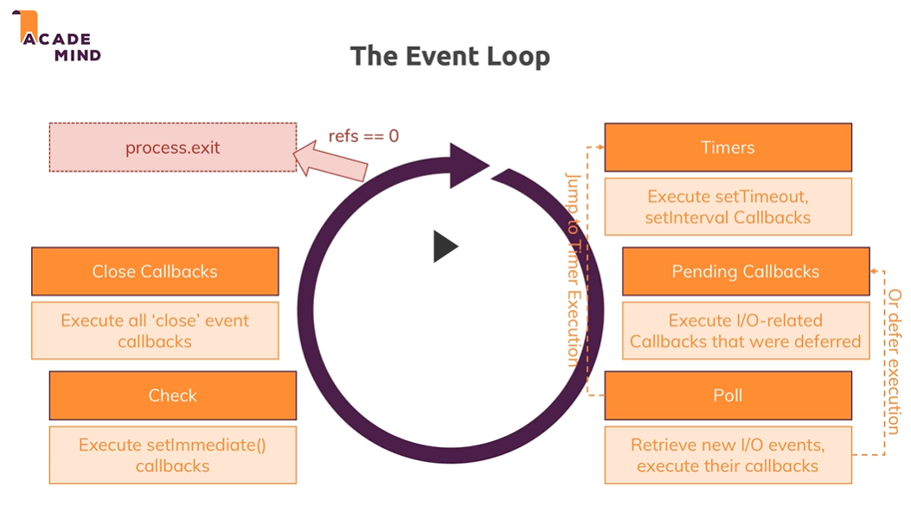
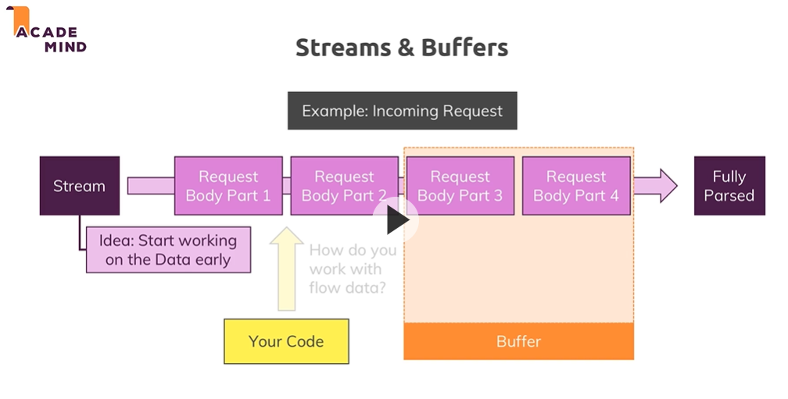

#### reference Notes from Node.js - The Complete Guide by Maximilian Schwarzmuller
- module Understanding the basics summary 
#### core concepts
- node ships with core modules - http , https , fs , path , os
- core modules can be imported using `require('http')`
- to import custom file or module use `require('./xxx')` . **custom file path must start** with `./` or `/` for relative and absolute path respectively
- import does not require .js in the inport statement
##### node lifecycle and event loop
- when a js file is executed via node the nodejs event loop kicks in and it will keep running until there is any event listener alive
- to quit a program you can use `process.exit()`
- eventloop only handles callbacks that contains fast executing code
- long operations are sent to worker pool. Worker pool is on another thread
- reference1 
- reference2 
##### node creating a server
- import http module
- use `createServer` method from this module to create server , it accepts  function that takes params request of type IncomingMessage and response of type ServerResponse. this createserver returns server
- run this server uing server.listen
##### sending server responses
- response.setHeader
- response.write
- response.end
- response must have end to end creation of response and there should not be any other code execution after end
##### streams and Buffers
- stream is ongoing process , like server request has ongoing work which gets streamed.
- **node handle all request as stream**
- Buffer is a construct which holds multiple chunks and allows us to work with the chunk before they are released once we are done
- reference 

#### using node modules system
- a method can be exported using `module.exports = requestHandler;` where requestHandler is to be exported
- another way to export is 
```module.exports = {
     handler: requestHandler,
 };
```
- another way is `module.exports.handler = requestHandler;`
- one more way is `exports.handler = requestHandler;`

### Express concepts
- [link to express md ](./express.md)
